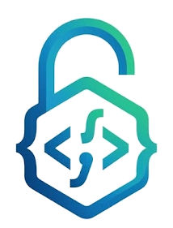
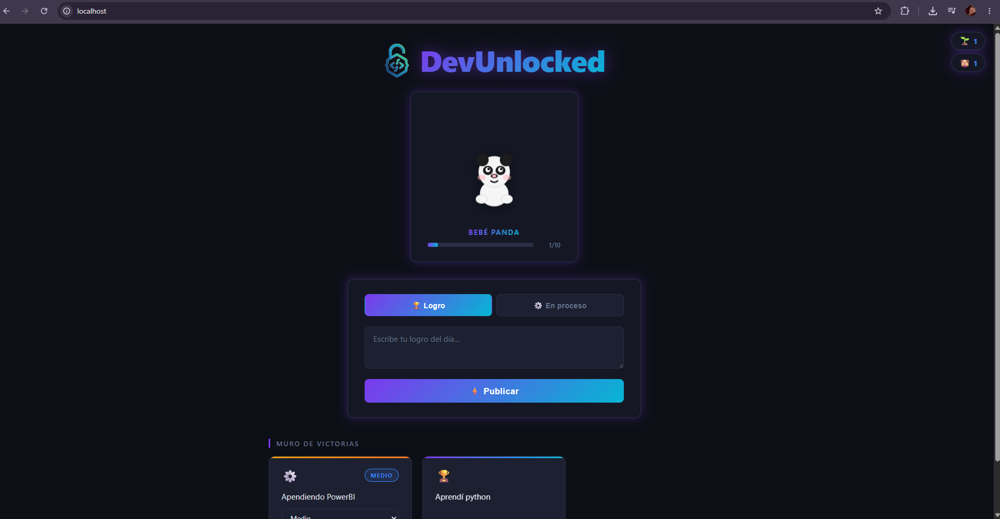
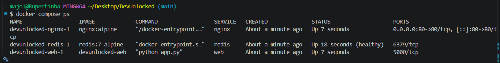
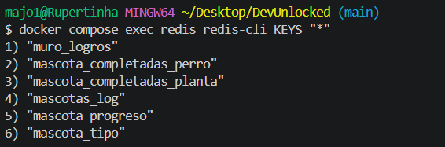

<p align="center">
  
</p>

# DevUnlocked 🔓

**DevUnlocked** es una aplicación web gamificada para que desarrolladores (o cualquier persona) registren sus logros y procesos de aprendizaje de forma motivadora. Cada logro que publicas hace crecer a tu mascota virtual, y cuando tu compañero llega al nivel máximo, ¡se completa y puedes elegir uno nuevo!

---

## Demo


https://github.com/user-attachments/assets/66a7ef83-8328-4346-888c-7a36b298a22b


---

## Características

- **Muro de victorias** — publica logros puntuales o procesos en curso que aparecen en un tablero compartido.
- **Mascota virtual** — elige entre cuatro compañeros (🌱 Planta, 🐼 Panda, 🐶 Perro, 🐱 Gato) que evolucionan visualmente en 5 etapas.
- **Sistema de progreso** — cada logro publicado suma 1 punto a tu mascota. Al llegar a 10 puntos, tu compañero se completa y puedes elegir uno nuevo.
- **Procesos con niveles** — los procesos en curso se clasifican en `Bajo`, `Medio`, `Medio avanzado` o `Avanzado`, y puedes actualizar su nivel en cualquier momento.
- **Celebraciones animadas** — fuegos artificiales y mensajes motivadores al publicar un logro o subir de nivel.
- **Contador de completadas** — badges que muestran cuántas veces has completado cada mascota.
- **Persistencia con Redis** — toda la información se guarda en Redis, lo que garantiza velocidad y bajo consumo de recursos.

---

## Stack tecnológico

| Capa        | Tecnología                         |
|-------------|-------------------------------------|
| Backend     | Python 3.11 + Flask                 |
| Base de datos | Redis 7                           |
| Servidor web | Nginx (proxy inverso)              |
| Frontend    | HTML5 + CSS3 + JavaScript vanilla   |
| Contenedores | Docker + Docker Compose            |
| Imagen publicada | [majorodri/devunlocked](https://hub.docker.com/repository/docker/majorodri/devunlocked/general) (`v1`) |

---

<details>
<summary><strong>Cómo funciona</strong></summary>

```
Usuario publica un logro
        │
        ▼
Flask recibe el formulario → guarda el logro en Redis (lista "muro_logros")
        │
        ▼
Si es un "logro": progreso de la mascota +1
Si es un "proceso llegando a Avanzado": progreso de la mascota +1
        │
        ▼
¿Progreso == 10?
  Sí → mascota completada, contador +1, progreso vuelve a 0
  No → continúa normalmente
        │
        ▼
Redirección a "/" con parámetros de query → JavaScript muestra animación
```

</details>

---

<details>
<summary><strong>Estructura del proyecto</strong></summary>

```
DevUnlocked/
├── app/
│   ├── Dockerfile              # imagen de la aplicación Flask
│   ├── app.py                  # punto de entrada, registra blueprints
│   ├── config.py               # constantes: niveles y nombres de etapas
│   ├── extensions.py           # conexión a Redis
│   ├── requirements.txt        # dependencias Python
│   ├── routes/
│   │   ├── main.py             # GET / — página principal
│   │   ├── achievements.py     # POST /añadir, POST /actualizar-nivel
│   │   └── pets.py             # POST /elegir-mascota
│   ├── services/
│   │   ├── pet_service.py      # lógica de progreso y estado de mascota
│   │   └── achievement_service.py  # parseo de logros desde Redis
│   ├── templates/
│   │   ├── base.html           # layout base
│   │   ├── index.html          # página principal
│   │   └── components/
│   │       ├── badges.html     # contador de mascotas completadas
│   │       ├── form_card.html  # formulario para publicar
│   │       ├── modal.html      # modal para elegir mascota
│   │       ├── pet_card.html   # barra de progreso y etapa actual
│   │       ├── wall.html       # muro de logros
│   │       └── pets/           # SVGs animados de cada mascota por etapa
│   │           ├── plant.html
│   │           ├── panda.html
│   │           ├── dog.html
│   │           └── cat.html
│   └── static/
│       ├── style.css
│       └── js/
│           ├── main.js         # lógica de entrada: detecta parámetros y activa efectos
│           ├── celebration.js  # mensajes motivadores aleatorios
│           ├── fireworks.js    # animación de fuegos artificiales con Canvas
│           ├── modal.js        # apertura del modal de elección de mascota
│           └── tabs.js         # cambio entre pestaña "Logro" y "En proceso"
├── nginx/
│   ├── Dockerfile              # imagen nginx con la config incluida
│   └── nginx.conf              # proxy inverso apuntando a Flask en el puerto 5000
├── .env                        # variables de entorno (REDIS_HOST, REDIS_PORT)
├── docker-compose.yml          # orquestación de los tres servicios
└── requirements.txt            # dependencias Python (espejo del de /app)
```

</details>

---

## Instalación

### Requisitos

- [Docker](https://www.docker.com/products/docker-desktop/) versión 24 o superior
- Puerto **80** disponible en tu máquina

---

### Opción 1 — Solo comandos (recomendado)

Las imágenes están publicadas en Docker Hub. No necesitas clonar el repositorio.

```bash
docker network create devunlocked-net

docker run -d --name redis --network devunlocked-net redis:7-alpine

docker run -d --name web --network devunlocked-net \
  -e REDIS_HOST=redis \
  -e REDIS_PORT=6379 \
  majorodri/devunlocked-web:v1

docker run -d --name nginx --network devunlocked-net -p 80:80 majorodri/devunlocked-nginx:v1
```

Visita [http://localhost](http://localhost).

**Para detener:**

```bash
docker stop nginx web redis
docker rm nginx web redis
docker network rm devunlocked-net
```

> Para borrar los datos de Redis: `docker rm -v redis`

---

### Opción 2 — Clonar el repositorio

```bash
git clone https://github.com/MajoRodri/DevUnlocked.git
cd DevUnlocked
docker compose up --build
```

Visita [http://localhost](http://localhost).

**Para detener:**

```bash
docker compose down
```

> Para borrar datos: `docker compose down -v`

---

<details>
<summary><strong>Configuración — variables de entorno y claves Redis</strong></summary>

Todas las variables se definen en `.env` en la raíz del proyecto.

| Variable     | Valor por defecto | Descripción                                     |
|--------------|-------------------|-------------------------------------------------|
| `REDIS_HOST` | `redis`           | Host de Redis. Usa `localhost` sin Docker.      |
| `REDIS_PORT` | `6379`            | Puerto de Redis. Raramente necesita cambiarse.  |

**Claves almacenadas en Redis:**

| Clave                          | Tipo   | Descripción                                  |
|--------------------------------|--------|----------------------------------------------|
| `muro_logros`                  | Lista  | Todos los logros/procesos en formato JSON    |
| `mascota_tipo`                 | String | Mascota activa: `planta`, `panda`, `perro` o `gato` |
| `mascota_progreso`             | String | Progreso actual de la mascota (0–10)         |
| `mascota_completadas_planta`   | String | Veces que se completó la planta              |
| `mascota_completadas_panda`    | String | Veces que se completó el panda               |
| `mascota_completadas_perro`    | String | Veces que se completó el perro               |
| `mascota_completadas_gato`     | String | Veces que se completó el gato                |

</details>

---

<details>
<summary><strong>Uso de la aplicación</strong></summary>

### Publicar un logro

1. Asegúrate de que la pestaña **"Logro"** esté activa.
2. Escribe tu logro en el campo de texto.
3. Haz clic en **"Publicar"**.
4. Tu logro aparece en el muro, tu mascota gana 1 punto y se lanzan fuegos artificiales.

### Registrar un proceso en curso

1. Cambia a la pestaña **"En proceso"**.
2. Escribe el proceso (ej: "Aprendiendo Docker").
3. Selecciona el nivel inicial: `Bajo`, `Medio`, `Medio avanzado` o `Avanzado`.
4. Haz clic en **"Publicar"**.

### Actualizar el nivel de un proceso

En el muro, usa el selector desplegable de la tarjeta para cambiar el nivel. El cambio se guarda al instante.

> Subir a **Avanzado** también suma 1 punto de progreso a tu mascota.

### Evolucionar tu mascota

La barra muestra los puntos acumulados (0/10). Al llegar a 10, aparece la animación de celebración y puedes elegir una nueva mascota.

### Cambiar de mascota manualmente

La mascota solo se puede cambiar cuando se completa (10 puntos), para mantener la mecánica de juego.

### Resetear todos los datos

Visita `http://localhost/reset` en el navegador. Borra todos los logros, el estado de la mascota y los contadores de completadas. Útil para empezar de cero.

</details>

---

## Capturas

<details>
<summary><strong>Ver capturas</strong></summary>

**App en el navegador**


**docker compose ps**


**redis-cli KEYS ***


</details>

---

## Qué aprendí

- **El DNS interno de Docker** — dentro de una red Docker Compose, los contenedores se comunican por el nombre del servicio, no por `localhost`. Intentar conectar a `localhost:6379` desde el contenedor Flask falla porque `localhost` apunta al propio contenedor, no a Redis.
- **El orden importa en el Dockerfile** — copiar `requirements.txt` antes que el código fuente permite que Docker cachee la capa de dependencias. Si solo cambia el código, `pip install` no se vuelve a ejecutar, lo que hace los builds mucho más rápidos.
- **`service_healthy` vs `depends_on` simple** — `depends_on` solo espera a que el contenedor arranque, no a que el servicio dentro esté listo. Con `condition: service_healthy` y un healthcheck en Redis, Flask espera a que Redis realmente responda antes de intentar conectarse.
- **Volúmenes con nombre vs bind mounts** — un volumen con nombre (`datos_redis:/data`) persiste entre `docker compose down` y `docker compose up`. Solo se borra al usar `-v`. Esto garantiza que los datos sobreviven a reinicios.
- **Nginx como única puerta de entrada** — al no exponer el puerto 5000 de Flask al host, el usuario nunca habla directamente con la app. Todo pasa por Nginx, que actúa como proxy inverso, replicando el comportamiento de un entorno de producción real.

---

<details>
<summary><strong>Solución de problemas</strong></summary>

<details>
<summary>La página no carga — "connection refused"</summary>

**Causa:** Redis no está corriendo o no es accesible.

- Con Docker: `docker compose ps` — el servicio `redis` debe mostrar `healthy`.
- Sin Docker: `redis-cli ping` — debe responder `PONG`.

</details>

<details>
<summary>Error al construir con Docker: <code>port 80 is already allocated</code></summary>

Otro proceso usa el puerto 80. Cambia el puerto en `docker-compose.yml`:

```yaml
nginx:
  ports:
    - "8080:80"
```

Accede en [http://localhost:8080](http://localhost:8080).

</details>

<details>
<summary>Los logros desaparecieron después de <code>docker compose down</code></summary>

Si usaste `-v`, se eliminaron los volúmenes. Para detener sin perder datos usa siempre:

```bash
docker compose down
```

</details>

<details>
<summary>La mascota no aparece o muestra un estado incorrecto</summary>

Conéctate a Redis y borra las claves:

```bash
# Con Docker:
docker compose exec redis redis-cli

# Sin Docker:
redis-cli
```

```
DEL mascota_tipo
DEL mascota_progreso
```

Recarga la página — el modal de elección aparecerá de nuevo.

</details>

<details>
<summary>Error 405 Method Not Allowed</summary>

Estás accediendo a una ruta POST directamente desde el navegador. Usa siempre los formularios de la interfaz.

Rutas que solo aceptan `POST`:
- `/añadir`
- `/actualizar-nivel`
- `/elegir-mascota`

</details>

<details>
<summary>Los fuegos artificiales no se muestran</summary>

- Verifica que JavaScript esté habilitado.
- Prueba en modo incógnito para descartar extensiones.
- La animación usa `requestAnimationFrame` y Canvas 2D — compatibles con todos los navegadores modernos.

</details>

</details>
